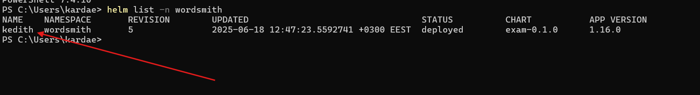
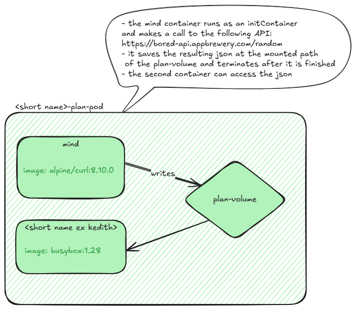

# Exam

🌵 - means you have to save some solution

*Grading: 5 + 4 + 1*

### Naming rules
- **use your name** when running the app from the **Debugging** (more details below)
- screenshot names - after the following pattern: ex*EXERCISE_NUMBER*._INDEX_ (ex. ```ex1.0```, ```ex1.1``` - the names of 2 images for the same exercise 1)
- screenshots saved in debugging folder

## Debugging - 5 points

🌵 Create a folder called ```debugging```. Add all the screenshots created in the steps below.


### To run the exam environment

- in the ```web``` folder: build the docker image called ```exam/wordsmith-web:local```
- in the ```api``` folder: build the docker image called ```exam/wordsmith-api:local```
- create the namespace ```wordsmith```
- in the ```helm/exam``` folder: install the helm chart in the ```wordsmith``` namespace, name the release after this pattern ```kedith``` (use the initial of your name and last name)
  - command to verify you named it correctly: ```helm list -n wordsmith```

  
### 🚀 Debugging exercises

1. 🌵 (2p) Check out [this](README.md) app documentation first. Use the ```wordsmith``` namespace. The database is populated with data using a configmap. This in turn uses the ```words.sql``` script to create the SQL INSERTs. Change the noun insert value from "student" to **your full name**. The change should be visible in the browser → 2 screenshots: web result & solution
2. 🌵 (3p) There are pods deployed in multiple namespaces. Inspect them and identify the 3 pods which are not in a ```Ready``` state. Troubleshoot and fix the issue. -> 6 screenshots: 2 for each pod - web result & solution


## Kubernetes - 4 points

🌵 Create a folder called ```kubernetes```. Add all the YAML files created in the steps below.

### 🚀 Kubernetes exercises



- (2p) 🌵 Create the resource described in the diagram above. Hint: url to copy easily: https://bored-api.appbrewery.com/random
- (1p) 🌵 Deploy the kubernetes resource -> screenshot of the pod with the two containers running successfully
- (1p) 🌵 Open an interactive shell for container 2 and navigate to the directory where the plan-volume is mounted. Inspect the contents of
  file inside it -> Take a screenshot, add it to the ```kubernetes``` folder. Exit out the container.